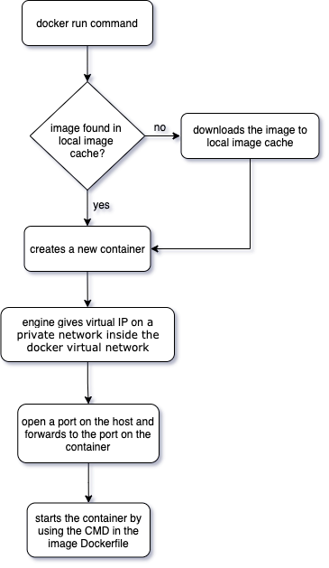

# **What happens in 'docker container run'?**

    

 

1. Docker engine looks for the image (specified at the end of the command) in local image cache
2. If not found, then docker engine looks for the image in remote image repositroy and downloads the latest version (if version is not specified) to image cache
3. Creates a new container based on that image
4. Container creation doesn't make a copy of the image, docker engine starts a new layer of changes right on the top where the image left off
5. Docker engine gives a virual ip address on a private network inside the docker virtual network
6. Opens port on host and forwards to the port in the container
   
---